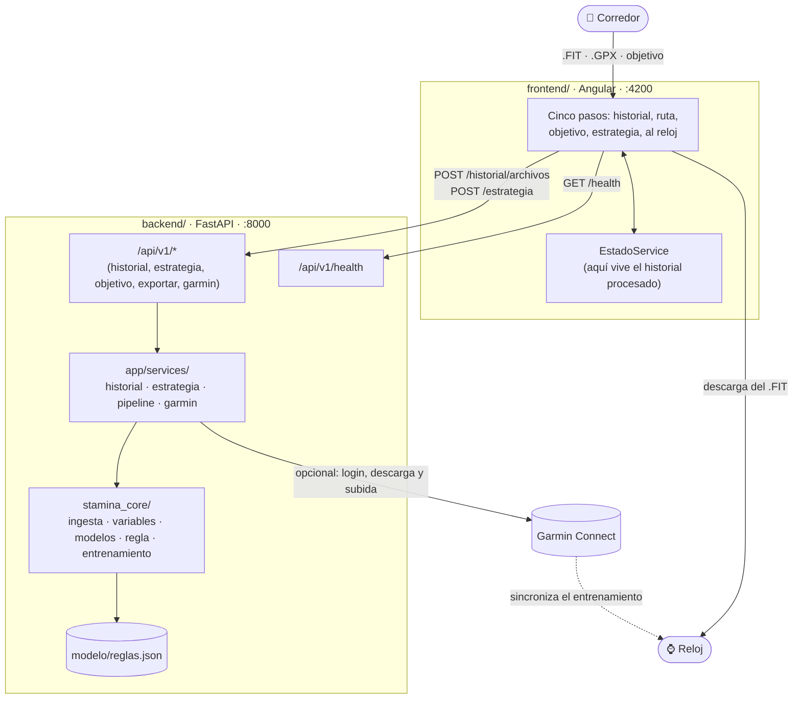
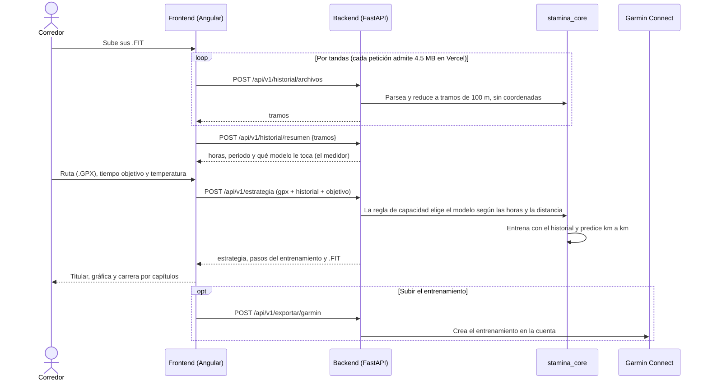
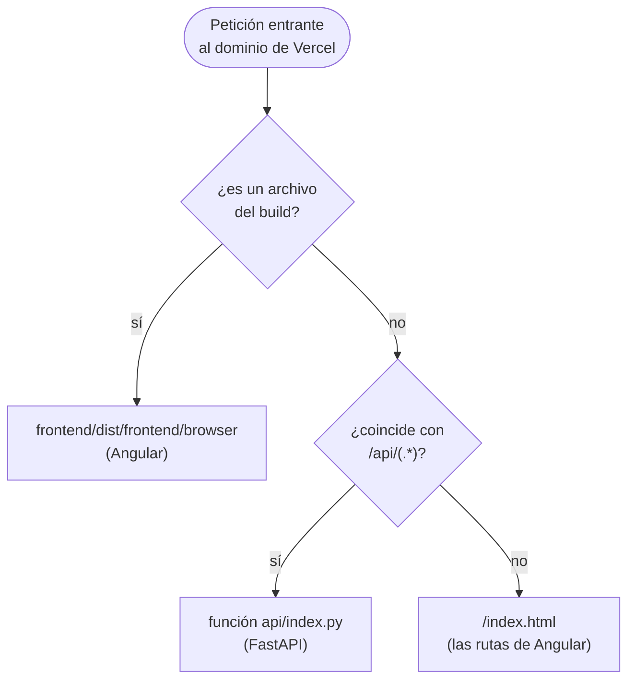

<p align="center">
  
</p>

# Stamina.AI

Estrategia de ritmo kilómetro a kilómetro para una carrera, a partir del
historial del propio corredor. La aplicación aprende de sus archivos `.FIT` cómo
cede en las cuestas y cómo se fatiga, lo cruza con la altimetría de la ruta
(`.GPX`) y devuelve el plan de carrera y un entrenamiento listo para el reloj.

> **Cuando no hay evidencia suficiente, el sistema devuelve ritmo constante y
> explica el motivo real.** No es consejo médico ni sustituye a un entrenador.

El repositorio está dividido en dos carpetas principales, más lo necesario para
desplegarlas juntas:

```
backend/           # API en FastAPI (Python) y el pipeline del modelo (stamina_core)
frontend/          # Aplicación en Angular (TypeScript) — interfaz de usuario
api/index.py       # Punto de entrada de la API en Vercel
vercel.json        # Config de despliegue (ver "Despliegue en Vercel")
requirements.txt   # Dependencias de la API en producción
docs/              # Metodología: la regla de capacidad y los límites del modelo
Makefile           # Atajos para instalar, levantar y probar todo
```

## Arquitectura



En producción (Vercel) la interfaz y la API quedan bajo el mismo dominio: ver
[«Despliegue en Vercel»](#despliegue-en-vercel).

## Cómo funciona

Al abrir se llega a la portada: la persona se presenta si quiere —el nombre se
queda en la pestaña y solo sirve para saludar— y entra. Después son cinco pasos:

1. **Historial**: sube sus `.FIT`, o los descarga de su cuenta de Garmin
   Connect. Un medidor enseña cuántas horas tiene frente al escalón a partir del
   cual el sistema personaliza.
2. **Ruta**: un `.GPX` con el recorrido de la carrera.
3. **Objetivo**: tiempo y temperatura. El selector «cómo quieres correrla»
   solo **sugiere** un tiempo a partir del historial; no cambia la forma de la
   estrategia.
4. **Estrategia**: una frase que cuenta la carrera («sal a 5:34–5:38 los
   primeros 7 km; lo más exigente va del km 18 al 21»), tres cifras grandes y
   la gráfica con la altimetría, el ritmo sugerido y las zonas de exigencia.
5. **Al reloj**: la carrera por capítulos, con los tramos del entrenamiento tal
   como los marcará el reloj. Se descarga el `.FIT` o se sube a Garmin Connect.



**La regla de capacidad** decide qué modelo se entrena: ritmo constante, una
base física de dos parámetros (cuánto cede en las cuestas y cómo se fatiga),
Ridge o Random Forest. Depende de las horas acumuladas de carrera y de la
distancia objetivo, y sale de la investigación (`backend/modelo/reglas.json`).
Ningún umbral está escrito en el código: la interfaz lo consulta siempre a la
API. Si el historial no alcanza, devuelve ritmo constante diciendo por qué; y si
la carrera es corta, el límite es la distancia y no las horas.

**El historial no se guarda en ningún servidor.** Los `.FIT` se reducen a tramos
de 100 m sin coordenadas, esos tramos vuelven al navegador y viajan en cada
cálculo. Al salir se borran con la pestaña.

## Backend (FastAPI)

Necesita Python 3.12 o más. En Windows, dentro de WSL (Ubuntu).

```bash
cd backend
python3.12 -m venv .venv
source .venv/bin/activate
pip install -e ".[dev]"
uvicorn app.main:app --reload --port 8000
```

- Documentación interactiva: http://localhost:8000/docs
- Salud del servicio: http://localhost:8000/api/v1/health. Dice si la regla
  está cargada (`reglas.cargadas`) y si Garmin está disponible
  (`garmin_habilitado`); la interfaz lo consulta al arrancar.
- Tests: `pytest -v` (con el entorno virtual activado). No usan la red: la
  suite la bloquea, Garmin incluido, y trabaja con carreras sintéticas.

Todos los endpoints cuelgan de `/api/v1`:

| Endpoint | Qué hace |
|---|---|
| `POST /historial/archivos` | Procesa `.FIT` y devuelve los tramos de 100 m, sin coordenadas. No guarda nada |
| `POST /historial/resumen` | Horas, sesiones, periodo y qué modelo le toca a ese historial |
| `GET /capacidad` | Qué modelo asigna la regla para unas horas y una distancia |
| `GET /objetivo/opciones`, `POST /objetivo/sugerencia` | El selector «cómo quieres correrla»: sugiere un tiempo a partir del historial |
| `POST /estrategia` | Ruta + historial + tiempo + temperatura → estrategia km a km, pasos del entrenamiento y `.FIT` |
| `POST /exportar/garmin` | Sube el entrenamiento a la cuenta de Garmin |
| `POST /garmin/login`, `POST /garmin/mfa`, `DELETE /garmin/sesion/{id}` | Sesión con Garmin Connect, con código de verificación |
| `POST /historial/garmin`, `GET /historial/garmin/{id}`, `POST /historial/garmin/{id}/cancelar` | Descarga del historial desde Garmin, con progreso |
| `POST /sesion/olvidar` | Al salir, suelta la sesión y la descarga de Garmin |

La lógica vive fuera de los endpoints (`backend/app/api/v1/`), en dos capas:

| Qué | Dónde | Qué contiene |
|---|---|---|
| Pipeline | `backend/stamina_core/` | La investigación como módulo importable, sin FastAPI: `ingesta.py` (lee `.FIT` y `.GPX`), `variables.py` (terreno y fatiga), `modelos.py` (los cuatro candidatos), `reglas.py` (la regla de capacidad), `pipeline.py` (de historial y ruta a estrategia) y `entrenamiento.py` (escribe el `.FIT`) |
| Servicios | `backend/app/services/` | Lo que une HTTP con el pipeline: procesar el historial, calcular la estrategia y hablar con Garmin |
| Regla | `backend/modelo/reglas.json` | La tabla que decide el modelo, lo único que la API carga. `metadata.joblib` es el modelo entrenado por la investigación, contra el que se validan las pruebas |

### Configuración

No hace falta ninguna: todo tiene un valor por defecto. Si hay que cambiar
algo, se ponen variables de entorno con el prefijo `STAMINA_` (o un `.env`
dentro de `backend/`, que no se versiona):

| Variable | Por defecto | Para qué |
|---|---|---|
| `STAMINA_ENVIRONMENT` | `dev` | `prod` en el despliegue |
| `STAMINA_DEBUG` | `True` | `False` en el despliegue |
| `STAMINA_CORS_ORIGINS` | `http://localhost:4200,http://127.0.0.1:4200` | Orígenes permitidos, separados por comas |
| `STAMINA_GARMIN_HABILITADO` | `True` | `False` apaga la conexión con Garmin, y la interfaz explica cómo exportar los `.FIT` a mano |
| `STAMINA_TTL_GARMIN_SEGUNDOS` | `900` | Cuánto vive una sesión de Garmin |
| `STAMINA_PROCESOS_PARSEO` | los núcleos disponibles | Procesos que leen `.FIT` a la vez |

**No hay variables de credenciales.** Las de Garmin las escribe la persona en su
sesión, viven en memoria mientras dura y no se guardan ni en disco, ni en logs,
ni en base de datos.

## Frontend (Angular)

Necesita Node 24 LTS.

```bash
cd frontend
npm install   # solo la primera vez
npm start     # ng serve
```

- Aplicación: http://localhost:4200
- La interfaz llama a la API con la ruta relativa `/api/v1`. En desarrollo,
  `proxy.conf.json` la manda a `http://localhost:8000`; en producción la
  resuelven las rewrites de Vercel, bajo el mismo dominio.
- Tests: `npm test` (Vitest).
- Los tipos de la API (`src/app/core/api/schema.d.ts`) no se escriben a mano:
  salen del OpenAPI del backend con `make contracts`.
- En WSL con el código en `/mnt/c`, añade `--poll 2000` a `ng serve`: ahí no
  llegan los eventos del sistema de archivos y la recarga no se entera de los
  cambios.

Dónde está cada cosa: los cinco pasos en `src/app/pages/estrategia/`, las
piezas visuales (medidor, carrera por capítulos, gráfica, diálogo de Garmin) en
`src/app/componentes/`, y el estado compartido y el formato de ritmos y fechas
en `src/app/core/`.

## Correr todo en desarrollo

Se necesitan **dos terminales**, una por servicio:

1. Terminal 1: `cd backend && source .venv/bin/activate && uvicorn app.main:app --reload --port 8000`
2. Terminal 2: `cd frontend && npm start`

O, en Linux o WSL, con el `Makefile`:

```bash
make setup   # la primera vez: venv del backend y dependencias del frontend
make dev     # API en :8000 e interfaz en :4200
make test    # pruebas del backend y del frontend
make help    # todos los comandos
```

Con ambos corriendo, abre http://localhost:4200, entra, sube los `.FIT` y el
`.GPX` y pulsa «Calcular mi estrategia».

## Despliegue en Vercel

`vercel.json` (raíz del repo) despliega la interfaz y la API como un solo
proyecto, en un solo dominio: el frontend como sitio estático y la API como una
función Python.

```json
{
  "framework": null,
  "installCommand": "cd frontend && npm ci",
  "buildCommand": "cd frontend && npm run build",
  "outputDirectory": "frontend/dist/frontend/browser",
  "functions": {
    "api/index.py": {
      "maxDuration": 300,
      "excludeFiles": "{frontend/**,docs/**,backend/tests/**,backend/scripts/**,backend/modelo/metadata.joblib,**/__pycache__/**,**/*.md}"
    }
  },
  "rewrites": [
    { "source": "/api/(.*)", "destination": "/api/index" },
    { "source": "/(.*)", "destination": "/index.html" }
  ]
}
```

Vercel sirve primero los archivos del build; las `rewrites` solo se aplican a lo
que no es un archivo, y en orden:



- `api/index.py` añade `backend/` al path e importa `app.main:app`, la misma
  aplicación que levanta `uvicorn` en local. FastAPI recibe la ruta original
  (`/api/v1/...`).
- `requirements.txt` (raíz) lleva solo lo que la API necesita para atender
  peticiones, sin las herramientas de desarrollo, porque Vercel limita cada
  función Python a 500 MB. `excludeFiles` deja fuera de la función todo lo que
  no usa.
- La API no guarda nada entre peticiones, porque Vercel no garantiza que dos
  caigan en el mismo proceso: el historial vuelve al navegador y la estrategia
  trae consigo sus pasos y su `.FIT`. Como cada petición admite 4.5 MB, el
  navegador sube los `.FIT` por tandas.
- `framework: null` evita que Vercel detecte FastAPI y se salte el build del
  frontend.

**En el dashboard de Vercel** (pantalla de importación del proyecto):

- **Root Directory** en `./`, donde está `vercel.json`.
- **Framework Preset**: Other. La instalación, el build y la salida ya los fija
  `vercel.json`.
- **Environment Variables** (Production):

  | Variable | Valor |
  |---|---|
  | `STAMINA_ENVIRONMENT` | `prod` |
  | `STAMINA_DEBUG` | `False` |
  | `STAMINA_PROCESOS_PARSEO` | `1` |

Después de desplegar, `https://<tu-proyecto>.vercel.app/api/v1/health` tiene que
decir `"cargadas": true` en `reglas`.

**Por comprobar en producción: Garmin.** Es la única parte con estado: la sesión
(login y código de verificación) y la descarga viven en la memoria de un
proceso. En Vercel puede fallar si el login y el código caen en instancias
distintas, o si la instancia se congela a mitad de la descarga. En ese caso la
interfaz se queda en Vercel y la API pasa a un servidor con un proceso
persistente (tentativamente, Render). Garmin además limita los accesos desde IP
de centros de datos; eso pasaría en cualquier servidor en la nube.

## Estructura del repositorio

- `backend/stamina_core/`: el pipeline de la investigación. No se toca para
  «mejorar el modelo»: las pruebas comprueban que reproduce los números del
  notebook de investigación.
- `backend/app/api/v1/`: un módulo por grupo de endpoints, registrados en
  `router.py`.
- `backend/app/services/`: la lógica entre HTTP y el pipeline.
- `backend/tests/`: pruebas con `pytest`, con carreras sintéticas y una copia
  mínima del historial en tramos (`tests/datos/`), sin coordenadas.
- `frontend/src/app/pages/`: las pantallas (portada, estrategia y el panel «por
  qué esta estrategia»). `componentes/` guarda las piezas reutilizables y
  `core/` los servicios compartidos.
- `frontend/marca/`: el logo original y la paleta de la marca.
- `docs/METODOLOGIA.md`: la regla de capacidad con sus números, qué está
  verificado y qué no, los límites del modelo y las referencias.
